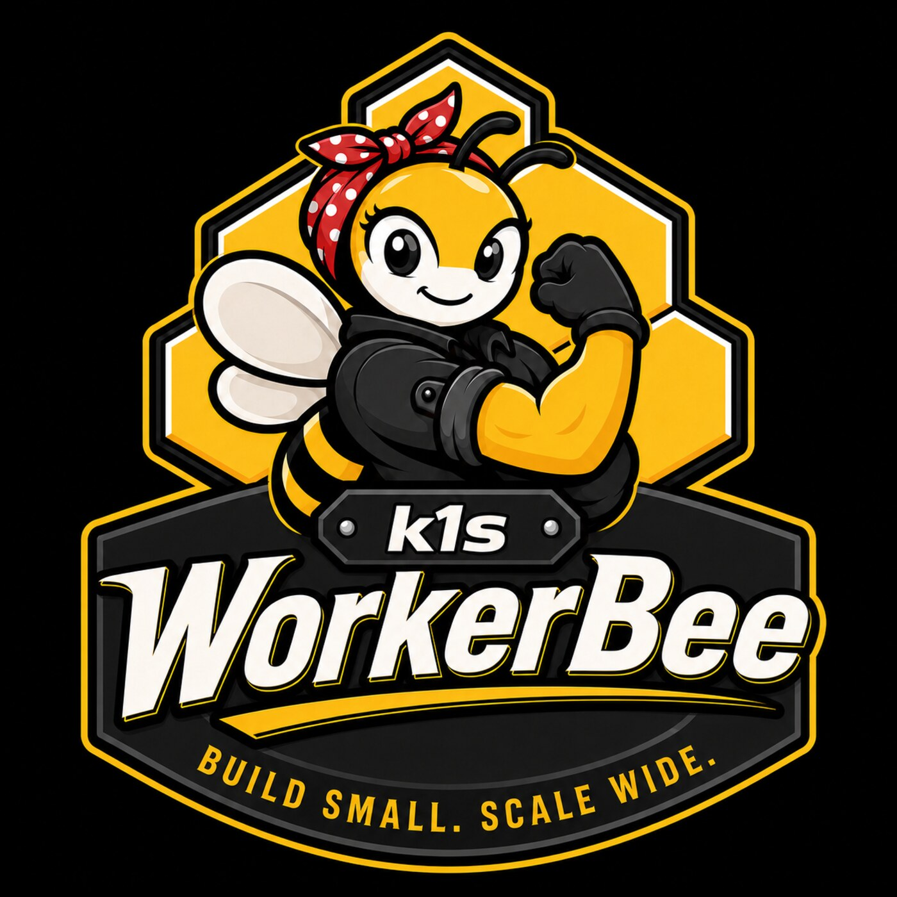

# K1S WorkerBee MCP

<p align="center">
  
</p>

WorkerBee is a local MCP workbench that gives coding agents a project-scoped
k1s-powered app engine for building, deploying, probing, and exporting
cloud-native applications on a developer machine.

WorkerBee v0.1 can use an installed `k1s-workerbee-runtime` wheel or a sibling
`../k1s` checkout without modifying k1s. The default workflow uses Podman or
Docker for ordinary app validation. Advanced k1s controller/runtime development
uses explicit direct containerd mode, where every k1s profile component is
containerized and scoped under WorkerBee-owned namespaces.

## Capabilities

- Shared local MCP daemon for one or more agents, with project-scoped state,
  runtime resources, dashboards, and ingress.
- Immediate global dashboard at `https://dashboard.workerbee.localhost:19443/`
  with project lifecycle controls and self-healing k1s profile ingress links.
- Local HTTPS ingress through Caddy under `*.workerbee.localhost`; CA trust is
  explicit and optional through `workerbee trust`.
- Agent workflow for image builds, native k1s manifest staging/deploy,
  status/log inspection, bounded exec, HTTPS probes, cleanup, and iteration.
- Advisory security assessment for staged manifests, existing exports, and
  WorkerBee-managed local ingress, with OWASP-oriented findings and policy
  suggestions that do not block deploy/export.
- Artifact handoff as native k1s bundles, Kubernetes YAML, Helm skeletons, and
  image metadata.
- Advanced direct containerd profiles for k1s development, including sqlite,
  etcd, direct containerd workload, and HA-min profile shapes.
- End-to-end profile workload validation with a realtime frontend/backend/db
  stack, dashboard/docs/API health checks, HTTPS ingress probes, WebSocket
  validation, logs/status, and exported handoff artifacts.

## Quickstart

Install WorkerBee:

```bash
curl -fsSL https://github.com/the-cm-collective/k1s-workerbee/releases/latest/download/install-workerbee.sh | sh
```

The installer uses the currently active Python virtual environment when `VIRTUAL_ENV` is set. If no venv is active, it creates a standalone WorkerBee venv under `${XDG_DATA_HOME:-~/.local/share}/workerbee/venv` and writes a `workerbee` wrapper to `~/.local/bin`. If that directory is not on `PATH`, the installer prints the exact `export PATH=...` line to add.

WorkerBee does not install container runtimes. It uses Podman or Docker for the default workflow and supports explicit direct containerd development with `nerdctl`.

Start the background MCP daemon:

```bash
workerbee mcp start
```

The command prints the local MCP URL and the global dashboard URL, normally
`https://dashboard.workerbee.localhost:19443/`. Use `workerbee mcp status`,
`workerbee mcp restart`, and `workerbee mcp stop` for lifecycle management. Use
`workerbee mcp serve` only when you want a foreground/debug process. If the
requested MCP port is already in use, `workerbee mcp start` fails fast; stop the
owning process or pass `--port`.

Connect Codex to the shared local MCP server:

```bash
codex mcp add workerbee --url http://127.0.0.1:8765/mcp
codex mcp list
workerbee agent instructions
```

For cloud-native repos, add this project instruction to `AGENTS.md`:

```markdown
When a task involves containers, services, manifests, ingress, databases, queues,
security review, or integration behavior, call WorkerBee MCP
`workerbee_v1_session_start` with the absolute repo cwd and task goal. Use the
returned `project` for every WorkerBee tool call. Use the local shell for repo
edits and ordinary tests, and use WorkerBee MCP for local image builds,
manifest staging/deploy, status, logs, HTTPS ingress probes, security review,
dashboard URLs, cleanup, and artifact export.

If this is the first time WorkerBee is coming up for a project, there may be no
deployed workload to inspect yet. Prefer existing repo manifests and
Containerfiles/Dockerfiles. When they are absent, build a temporary native k1s
deployment in WorkerBee state, deploy it locally, then rerun the requested
runtime validation or security review. Keep first-run generated artifacts in
WorkerBee state unless the user asks to commit them.
```

Use `workerbee agent install --check` to inspect whether the block is present.
Use `workerbee agent install --append --target AGENTS.md` to append it to an
existing repo file, or add `--allow-create` when you explicitly want WorkerBee
to create the file.

Build and install from a local wheelhouse:

```bash
scripts/build_wheelhouse.sh --k1s-root ../k1s --out dist/workerbee-wheelhouse
python -m venv .venv
. .venv/bin/activate
python -m pip install --no-index --find-links dist/workerbee-wheelhouse k1s-workerbee
workerbee doctor
```

The public one-line installer expects each GitHub release to include these
assets:

```text
install-workerbee.sh
workerbee-wheelhouse.tar.gz
```

The default installer URL resolves through GitHub's latest-release redirect:

```text
https://github.com/the-cm-collective/k1s-workerbee/releases/latest/download/install-workerbee.sh
```

Source checkout smoke workflow:

```bash
python -m pip install -e .[dev] --find-links dist/workerbee-wheelhouse
workerbee doctor
workerbee start
workerbee deploy-poc
workerbee poc-status
workerbee logs api
workerbee export-k8s
workerbee stop --purge
```

## NixOS Local Development

The simplest NixOS path is to use Nix for host tools and native library
compatibility, while keeping WorkerBee itself in an editable Python virtual
environment. This avoids packaging every Python dependency in Nix and keeps the
release wheel path representative.

```bash
direnv allow
scripts/build_wheelhouse.sh --k1s-root ../k1s --out dist/workerbee-wheelhouse
uv venv .venv
uv pip install -e '.[dev]' --find-links dist/workerbee-wheelhouse
workerbee doctor
```

The dev shell provides Python, `uv`, `ruff`, `node`, `jq`, `imagemagick`, and on
Linux, `nerdctl` plus CNI plugins for direct containerd development. Podman or
Docker daemon setup remains a host prerequisite for the default runtime path.
If `k1s-workerbee-runtime` is already available from your configured package
index, the local wheelhouse build and `--find-links` option can be omitted.

For the advanced direct containerd verification path, use the repo-local helper:

```bash
scripts/dev/wb-containerd mcp-restart
scripts/dev/wb-containerd mcp-status
scripts/dev/wb-containerd mcp-stop
```

The helper defaults to `/tmp/workerbee-containerd-verify`,
`127.0.0.1:8765`, and `sudo-helper`. Override with
`WORKERBEE_CONTAINERD_STATE_ROOT`, `WORKERBEE_MCP_HOST`,
`WORKERBEE_MCP_PORT`, or `WORKERBEE_MCP_TIMEOUT` when needed. It also accepts
normal WorkerBee arguments after applying the direct containerd defaults:

```bash
scripts/dev/wb-containerd --project k1s-dev profile list
```

For an installed/user-level WorkerBee, persist the same defaults once and then
use the normal `workerbee` command:

```bash
workerbee config set \
  --runtime containerd \
  --containerd-privilege sudo-helper \
  --state-root /tmp/workerbee-containerd-verify \
  --mcp-host 127.0.0.1 \
  --mcp-port 8765 \
  --mcp-timeout 90

workerbee mcp restart
workerbee mcp status
workerbee mcp stop
```

WorkerBee reads defaults from `${XDG_CONFIG_HOME:-~/.config}/workerbee/config.json`.
Explicit CLI flags still win, and environment variables such as
`WORKERBEE_RUNTIME`, `WORKERBEE_CONTAINERD_PRIVILEGE`,
`WORKERBEE_STATE_ROOT`, `WORKERBEE_MCP_HOST`, `WORKERBEE_MCP_PORT`, and
`WORKERBEE_MCP_TIMEOUT` override the config file. Use
`workerbee config show`, `workerbee config path`, or `workerbee config clear`
to inspect or reset these defaults.

The MCP daemon is intentionally shared. Multiple coding agents can connect to
the same local MCP server URL and operate on separate project scopes by passing
distinct `project` values to WorkerBee tools. The daemon stores those projects
under a global state root, defaults to `WORKERBEE_HOME`, then
`$XDG_DATA_HOME/workerbee`, then `~/.local/share/workerbee`, and exposes a
global dashboard as soon as MCP starts.

Agents should start each repo session with `workerbee_v1_session_start`. WorkerBee derives a stable project id from the Git repository name plus the current branch plus a cwd hash, persists the cwd for that project, and returns dashboard URLs plus the cloud-native runbook. This lets two Codex sessions share one MCP daemon while still building and deploying against the correct checkout and branch. Outside Git, WorkerBee uses the cwd basename plus the cwd hash. Explicit `--project` or MCP `project` values override this derived identity.

For example, in `~/git/k1s` on branch `dev`, WorkerBee derives a project similar to `k1s-dev-190438baf7`. App ingress is scoped under that project:

```text
https://app.k1s-dev-190438baf7.workerbee.localhost:19443/
https://api.k1s-dev-190438baf7.workerbee.localhost:19443/
```

Project mode controls whether WorkerBee starts for a repo:

```bash
workerbee project status
workerbee project mode lazy
workerbee project mode start --open
workerbee project mode stop
```

`lazy` is the default and starts the k1s stack only when deploy/start is requested. `start` starts immediately and persists for future Codex sessions. `stop` stops the project and makes WorkerBee MCP return `PROJECT_STOPPED` for start/deploy/runtime operations until the mode is changed.

Useful daemon commands:

```bash
workerbee mcp status
workerbee mcp stop
workerbee projects
workerbee global-dashboard
workerbee ingress status
workerbee trust status
```

`workerbee mcp stop` stops the background MCP daemon and its global
dashboard/Caddy ingress container. Project stacks remain controlled with
`workerbee stop`, `workerbee project mode stop`, or the MCP project stop/reset
tools.

The global dashboard also provides token-protected local controls to start, stop,
or delete one project, selected projects, or all known projects. Start can bring
a saved project stack back up outside the original agent session. Delete means
stop, purge project runtime/state, unregister the project from the global
dashboard, and resync WorkerBee Caddy imports. The dashboard can also request
MCP shutdown or an in-place MCP reboot.

Staged deployment workflow:

```bash
workerbee manifest prepare --name demo --template frontend-api-store
workerbee manifest validate --stage demo
workerbee security assess --stage demo
workerbee manifest deploy-local --stage demo
workerbee security review-project --stage demo
workerbee bundle export --stage demo --format k1s
```

`workerbee security assess` reviews a staged bundle directly. `workerbee
security review-project` reviews a deployed project and writes a JSON report
under the WorkerBee project state at `reports/security/`. When the deployment
was performed through MCP `workerbee_v1_manifest_deploy_local`, WorkerBee
records the latest stage and agents can usually call
`workerbee_v1_security_review_project` without passing `stage`. If no deployment
metadata exists, WorkerBee returns an actionable error listing available stages
so the agent can stage/deploy first or retry with an explicit stage.

The live security assessment report scenario is opt-in because it builds and
deploys a real local app through WorkerBee:

```bash
WORKERBEE_LIVE_SECURITY_REPORT=1 \
WORKERBEE_SECURITY_REPORT_OUT=/tmp/workerbee-security-report.json \
.venv/bin/python -m pytest tests/test_security_live.py -q
```

`--stage` accepts either the absolute `stage_dir` returned by prepare or the named stage under the project `artifacts/staged` directory. `manifest prepare --source <file-or-dir>` can stage native k1s YAML or practical Kubernetes YAML. Kubernetes input is applied through the k1s shim `ae apply --k8s` path and should keep exactly one workload plus matching Service/Ingress documents per file. Native k1s manifests are the required input when exporting a native k1s bundle; Kubernetes input can be exported as Kubernetes YAML or a Helm skeleton.

`workerbee_v1_ingress_probe` supports `GET`, `HEAD`, `POST`, `PUT`,
`PATCH`, `DELETE`, and `OPTIONS` plus `json_body`, raw `body`, and custom `headers`.
Use headers for signed smoke tests such as S3 presigned `PUT`; WorkerBee
intentionally blocks overriding `Host` and `Content-Length`.

Image builds support repo-root contexts with nested Dockerfiles:

```bash
workerbee build-image . --dockerfile backend/Dockerfile --tag workerbee-demo-api:dev
```

WorkerBee prefers an installed `k1s-workerbee-runtime` package. For source development it
falls back to a sibling k1s checkout at `../k1s`. Override with
`WORKERBEE_K1S_ROOT=/path/to/k1s`.

`workerbee start` prints the project k1s dashboard URL immediately. The default local URL is
`http://127.0.0.1:19108/dashboard` when that port is free. `workerbee mcp start` additionally prints the global dashboard URL, normally `https://dashboard.workerbee.localhost:19443/`.

When a project deploys app ingress through the MCP daemon, WorkerBee scopes hosts under the project name, for example `https://app.default.workerbee.localhost:19443/` and `https://api.default.workerbee.localhost:19443/`. Caddy terminates TLS with its local internal CA. WorkerBee never installs that CA implicitly; run `workerbee trust install` only when you explicitly want the local CA added to system/user trust stores.

The MCP SDK is installed by the package dependency. In a source checkout, build the
wheelhouse first or provide equivalent dependency links before running `workerbee mcp start`.

For container-orchestration development where Podman or Docker would interfere
with the system under test, run WorkerBee against direct containerd explicitly:

```bash
workerbee --runtime containerd --containerd-privilege sudo-helper mcp start
```

On Ubuntu/Debian hosts that also run MicroK8s with NVIDIA GPU Operator, the
operator toolkit can mutate MicroK8s' containerd template and signal MicroK8s
containerd. Before direct-containerd test runs on such a host, use the portable
dev guard:

```bash
scripts/dev/microk8s-nvidia-guard status
scripts/dev/microk8s-nvidia-guard apply
```

The guard is detection-driven and exits no-op on hosts without MicroK8s, without
NVIDIA GPU Operator, or where the toolkit is not targeting MicroK8s containerd.
When applicable, it temporarily suspends the owning Flux Kustomization and GPU
Operator HelmRelease, following parent Kustomization labels when necessary so
GitOps does not immediately re-apply the HelmRelease. It disables only the
NVIDIA toolkit component, verifies MicroK8s health, and records rollback state
under `/tmp`. Restore the previous state after the test window with:

```bash
scripts/dev/microk8s-nvidia-guard rollback
```

Containerized k1s profiles are only available in direct containerd mode. They
are intended for advanced k1s development, not ordinary app-stack use. WorkerBee
currently ships these built-in profiles:

```text
k1s-dev-min-sqlite          1 controller + API shim/dashboard + sqlite
k1s-dev-etcd-labs           1 controller + API shim/dashboard + etcd
k1s-single-etcd-containerd  1 controller + API shim/dashboard + etcd + direct containerd workloads
k1s-ha-min                  3 controllers + API shim/dashboard + shared etcd + shared NATS
```

No k1s profile starts a k1s controller, API shim, etcd, NATS, or dashboard as a host process. Use:

```bash
workerbee --runtime containerd profile list
workerbee --runtime containerd --project k1s-dev profile start --profile k1s-ha-min --k1s-root ../k1s
workerbee --runtime containerd --project k1s-dev profile status
workerbee --runtime containerd --project k1s-dev validate --scenario k1s-profile --profile k1s-ha-min --k1s-root ../k1s
workerbee --runtime containerd --project k1s-dev profile stop --purge
```

When run through the MCP daemon, profile controller/API ingress is published under the project namespace, for example `https://k1s.k1s-dev.workerbee.localhost:19443/dashboard` and `https://k1s-api.k1s-dev.workerbee.localhost:19443/`.

The canonical profile controller URL is now `https://k1s.<project>.workerbee.localhost:19443/`.
It exposes dashboard and docs paths such as:

```text
https://k1s.k1s-dev.workerbee.localhost:19443/dashboard
https://k1s.k1s-dev.workerbee.localhost:19443/docs
https://k1s.k1s-dev.workerbee.localhost:19443/redoc
https://k1s-api.k1s-dev.workerbee.localhost:19443/
```

`k1s-dash.<project>.workerbee.localhost` remains a compatibility alias for the
dashboard. WorkerBee profile workload operations use the project profile's
internal admin token and WorkerBee's generated CA to call the exposed profile API;
tokens are not returned in MCP or CLI results.

Profile workload deploy/status/log/validate operations require the background
MCP daemon for project-scoped Caddy ingress. To exercise the
app-engine-in-app-engine path, start MCP, stage a realtime frontend/backend/db
bundle, and deploy it into a running profile:

```bash
workerbee --runtime containerd --containerd-privilege sudo-helper mcp start
workerbee --runtime containerd --project k1s-dev profile start --profile k1s-ha-min --k1s-root ../k1s
workerbee --runtime containerd --project k1s-dev manifest prepare --name realtime --template realtime-web-db
workerbee --runtime containerd --project k1s-dev manifest deploy-local \
  --target profile \
  --profile k1s-ha-min \
  --stage .workerbee/k1s-dev/artifacts/staged/realtime
workerbee --runtime containerd --project k1s-dev profile status
```

The MCP equivalents are `workerbee_v1_manifest_prepare`,
`workerbee_v1_manifest_deploy_local(target="profile")`,
`workerbee_v1_profile_workload_status`, and `workerbee_v1_logs(target="profile")`.
For a single end-to-end validation, use:

```bash
workerbee --runtime containerd --project k1s-dev validate \
  --scenario profile-workload \
  --profile k1s-ha-min \
  --k1s-root ../k1s
```

That validation builds the bundled realtime image contexts, starts the requested
k1s profile, deploys native k1s manifests into the profile through the
project-scoped API, checks dashboard/docs/API health, probes HTTPS app ingress,
verifies a WebSocket echo path, collects workload status, and exports k1s,
Kubernetes, and Helm handoff artifacts.

This path uses `nerdctl` against the configured containerd socket, but scopes
WorkerBee work into state-root-hashed namespaces such as
`workerbee-<state-hash>-system` and `workerbee-<state-hash>-<project>`. It also
uses state-local nerdctl data roots, state-local CNI config directories, and
state-hash-scoped project networks. WorkerBee must never target reserved
namespaces such as `ae`, `k8s.io`, `moby`, or `default`; those may belong to a
real k1s/Kubernetes runtime on the same host.

When `--runtime containerd` is explicitly selected, WorkerBee MCP defaults to `--containerd-privilege auto`. Auto first tries unprivileged `nerdctl`; if that fails, WorkerBee prompts once with `sudo` and starts a state-scoped root helper. The helper exposes a WorkerBee-owned Unix socket and a generated `nerdctl` wrapper under the WorkerBee state root, validates every command, and only allows WorkerBee state-hash namespaces plus state-local data/CNI paths. This never runs for `--runtime auto`, Docker, or Podman. Use `--containerd-privilege unprivileged` if you preconfigured rootless/system access yourself.

Inspect or stop the helper with:

```bash
workerbee --runtime containerd containerd-privilege status
workerbee --runtime containerd containerd-privilege stop-helper
```

Shared host containerd is still a privileged development mode. WorkerBee avoids broad prune operations and cleanup is constrained to WorkerBee state-hash namespaces, but Podman or Docker remains the safer default for ordinary users.

Other MCP clients can connect to the same Streamable HTTP endpoint if they support HTTP MCP. For example, Claude Code documents `claude mcp add --transport http workerbee http://127.0.0.1:8765/mcp`; Codex is the tested target for WorkerBee v0.1.

Uninstall standalone WorkerBee:

```bash
rm -rf "${XDG_DATA_HOME:-$HOME/.local/share}/workerbee/venv" "$HOME/.local/bin/workerbee"
```

If installed into an active venv, uninstall with `python -m pip uninstall k1s-workerbee`.

## macOS Notes

macOS support is best effort for v0.1, with Docker Desktop as the recommended
runtime for the default WorkerBee app workflow. Install Python 3.11 or newer,
install Docker Desktop, start Docker Desktop, and confirm the Docker CLI works:

```bash
python3.11 --version
docker version
```

One-line install:

```bash
curl -fsSL https://github.com/the-cm-collective/k1s-workerbee/releases/latest/download/install-workerbee.sh | PYTHON=python3.11 sh
export PATH="$HOME/.local/bin:$PATH"
workerbee doctor
```

The installer uses an active virtual environment when one is enabled. Without an
active venv, it creates a standalone WorkerBee venv under
`${XDG_DATA_HOME:-$HOME/.local/share}/workerbee/venv` and writes a wrapper to
`~/.local/bin/workerbee`.

Clone/dev install:

```bash
git clone git@github.com:the-cm-collective/k1s-workerbee.git
cd k1s-workerbee
python3.11 -m venv .venv
. .venv/bin/activate
python -m pip install -U pip
mkdir -p dist
curl -fsSL https://github.com/the-cm-collective/k1s-workerbee/releases/latest/download/workerbee-wheelhouse.tar.gz -o dist/workerbee-wheelhouse.tar.gz
tar -xzf dist/workerbee-wheelhouse.tar.gz -C dist
python -m pip install -e '.[dev]' --find-links dist/workerbee-wheelhouse
workerbee doctor
```

If you are developing against a sibling k1s checkout instead of the published
runtime wheel, rebuild the wheelhouse from that checkout:

```bash
scripts/build_wheelhouse.sh --k1s-root ../k1s --out dist/workerbee-wheelhouse --python .venv/bin/python
python -m pip install -e '.[dev]' --find-links dist/workerbee-wheelhouse
```

With Docker Desktop, WorkerBee is intended to support the same default app
workflow used on Linux Docker/Podman hosts, with comparable default-app
capability to the direct-containerd backend: MCP daemon, global dashboard, Docker
image builds, local deploy/status/logs/exec, HTTPS ingress probes, POC
validation, cleanup, and artifact export.

```bash
workerbee --runtime docker mcp start
workerbee --runtime docker deploy-poc
workerbee --runtime docker poc-status
workerbee --runtime docker logs api
workerbee --runtime docker export-k8s
workerbee --runtime docker stop --purge
workerbee --runtime docker mcp stop
```

Direct-containerd profiles, the MicroK8s/NVIDIA guard, and
`scripts/dev/wb-containerd` are Linux/containerd development paths. They are not
the expected Docker Desktop path on macOS.

To trust the local WorkerBee Caddy CA after `workerbee mcp start`, run:

```bash
workerbee trust install --target system
```
