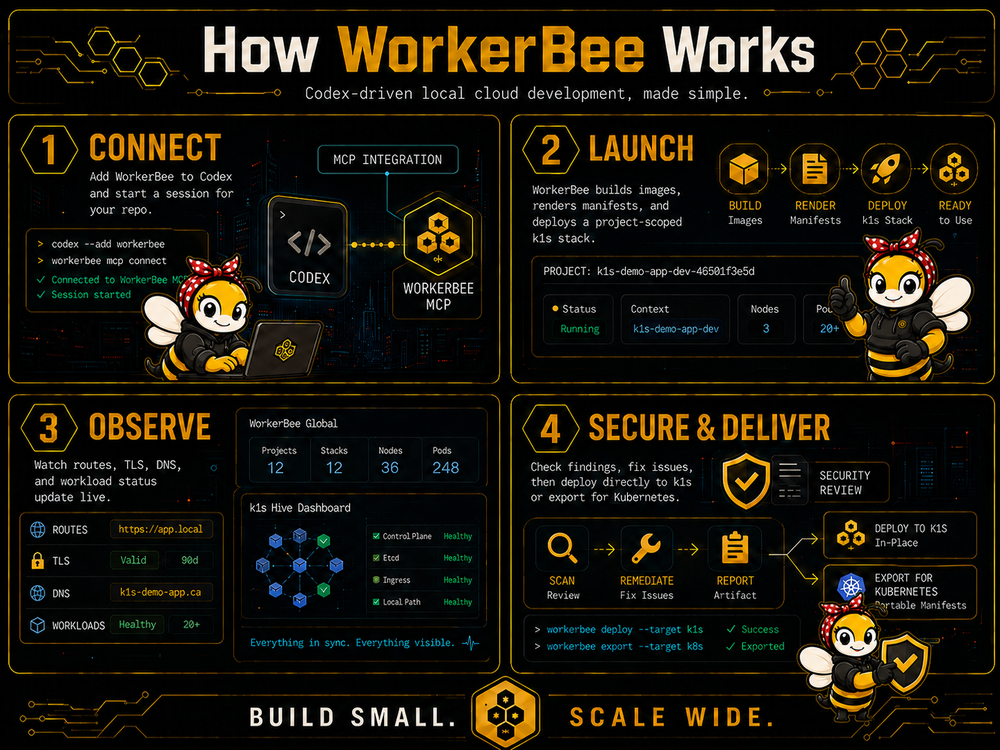

# K1S WorkerBee MCP

<p align="center">
  
</p>

WorkerBee is a local MCP workbench that gives coding agents a project-scoped
k1s-powered app engine for building, deploying, probing, and exporting
cloud-native applications on a developer machine.

WorkerBee v0.1 can use an installed `k1s-workerbee-runtime` wheel or a sibling
`../k1s` checkout without modifying k1s. The default workflow uses Podman or
Docker for ordinary app validation. Advanced k1s controller/runtime development
uses explicit direct containerd mode, where every k1s profile component is
containerized and scoped under WorkerBee-owned namespaces.

## What WorkerBee Does

WorkerBee gives coding agents a local cloud-native loop they can use without
turning your workstation into a shared cluster. For each project, it can build
images, stage native k1s or practical Kubernetes manifests, run the workload,
probe HTTPS ingress, inspect status and logs, run bounded commands, review
basic security posture, and export handoff artifacts.

The short version: you keep editing in your repo, and WorkerBee gives the agent
a bounded build-deploy-check-export workbench around that repo.

<p align="center">
  
</p>

## Capabilities

- Shared local MCP daemon for one or more agents, with project-scoped state,
  runtime resources, dashboards, and ingress.
- Immediate global dashboard at `https://dashboard.workerbee.localhost:19443/`
  with project lifecycle controls and self-healing k1s profile ingress links.
- Local HTTPS ingress through Caddy under `*.workerbee.localhost`, with
  explicit LAN dev exposure, optional WorkerBee DNS forwarding for
  `*.workerbee.home.arpa`-style names, and explicit CA export, local trust, or
  LAN download handling when enabled.
- Agent workflow for image builds, native k1s manifest staging/deploy,
  status/log inspection, bounded exec, HTTPS probes, cleanup, and iteration.
- Advisory security assessment for staged manifests, existing exports, and
  WorkerBee-managed local ingress, with OWASP-oriented findings and policy
  suggestions that do not block deploy/export.
- Artifact handoff as native k1s bundles, Kubernetes YAML, Helm skeletons, and
  image metadata.
- Advanced direct containerd profiles for k1s development, including sqlite,
  etcd, direct containerd workload, and HA-min profile shapes.
- End-to-end profile workload validation with a realtime frontend/backend/db
  stack, dashboard/docs/API health checks, HTTPS ingress probes, WebSocket
  validation, logs/status, and exported handoff artifacts.

## Quickstart

### One-line install

```bash
curl -fsSL https://github.com/the-cm-collective/k1s-workerbee/releases/latest/download/install-workerbee.sh | sh
```

### Install from downloaded release artifacts

On Linux or macOS, open the latest GitHub release in a browser and download both
assets into the same local directory:

```text
install-workerbee.sh
workerbee-wheelhouse.tar.gz
```

Then run the installer from that directory and point it at the downloaded
wheelhouse archive:

```bash
chmod +x install-workerbee.sh
WORKERBEE_INSTALL_BASE_URL="file://$(pwd)" ./install-workerbee.sh
workerbee doctor
```

On macOS, pass an explicit Python 3.11+ interpreter when needed:

```bash
PYTHON=python3.11 WORKERBEE_INSTALL_BASE_URL="file://$(pwd)" ./install-workerbee.sh
```

The installer uses the currently active Python virtual environment when `VIRTUAL_ENV` is set. If no venv is active, it creates a standalone WorkerBee venv under `${XDG_DATA_HOME:-~/.local/share}/workerbee/venv` and writes a `workerbee` wrapper to `~/.local/bin`. If that directory is not on `PATH`, the installer prints the exact `export PATH=...` line to add.

WorkerBee does not install container runtimes. It uses Podman or Docker for the default workflow and supports explicit direct containerd development with `nerdctl`.

### Build and install from a local wheelhouse

```bash
scripts/build_wheelhouse.sh --k1s-root ../k1s --out dist/workerbee-wheelhouse
python -m venv .venv
. .venv/bin/activate
python -m pip install --no-index --find-links dist/workerbee-wheelhouse k1s-workerbee
workerbee doctor
```

The public one-line installer expects each GitHub release to include these
assets:

```text
install-workerbee.sh
workerbee-wheelhouse.tar.gz
```

The default installer URL resolves through GitHub's latest-release redirect:

```text
https://github.com/the-cm-collective/k1s-workerbee/releases/latest/download/install-workerbee.sh
```

### Start the background MCP daemon

```bash
workerbee mcp start
```

The command prints the local MCP URL and the global dashboard URL, normally
`https://dashboard.workerbee.localhost:19443/`. Use `workerbee mcp status`,
`workerbee mcp restart`, and `workerbee mcp stop` for lifecycle management. Use
`workerbee mcp serve` only when you want a foreground/debug process. If the
requested MCP port is already in use, `workerbee mcp start` fails fast; stop the
owning process or pass `--port`.

### Connect Codex to the shared local MCP server

```bash
codex mcp add workerbee --url http://127.0.0.1:8765/mcp
codex mcp list
workerbee agent instructions
```

### Add agent instructions to cloud-native repos

Add this project instruction to `AGENTS.md`:

```markdown
When a task involves containers, services, manifests, ingress, databases, queues,
security review, or integration behavior, call WorkerBee MCP
`workerbee_v1_session_start` with the absolute repo cwd and task goal. Use the
returned `project` for every WorkerBee tool call. Respect the returned project
mode: `lazy` waits until deploy/start is needed, `start` may already be
launching the stack, and `stop` means WorkerBee is disabled for that project
until the mode is changed.

Use the local shell for repo edits, ordinary tests, and repo-local build scripts.
Use WorkerBee MCP for local image builds, native k1s/Kubernetes manifest
prepare/validate/deploy, project status, logs, exec, HTTPS ingress status and
probes, security assessment/review, secret policy checks, dashboard URLs, trust
guidance, cleanup, and artifact export. Use named stages or returned `stage_dir`
values for manifest operations. Use app names plus the optional `namespace` for
logs/exec; do not guess generated runtime container names.

If the user asks to bring, run, or start the project up in WorkerBee, treat that
as a request for a running app workload. Build needed local images, stage and
validate manifests, deploy with `workerbee_v1_manifest_deploy_local`, then
inspect status/logs and probe ingress. Do not stop after
`workerbee_v1_project_start` if deployable manifests or
Containerfiles/Dockerfiles exist.

If this is the first time WorkerBee is coming up for a project, there may be no
deployed workload to inspect yet. Prefer existing repo manifests and
Containerfiles/Dockerfiles. When they are absent, build a temporary native k1s
deployment in WorkerBee state, deploy it locally, then rerun the requested
runtime validation or security review. Keep first-run generated artifacts in
WorkerBee state unless the user asks to commit them.

For security reviews, call `workerbee_v1_project_status` first, then
`workerbee_v1_security_review_project` for deployed workloads. If WorkerBee
reports no deployment metadata, stage/deploy the app or pass an explicit stage
and rerun the review. Summarize critical/high findings before lower-severity
items and include the report path.

For larger multi-feature requests, when prior WorkerBee stages are performing
well, scope a coherent feature batch, split it into feature checkpoints,
validate each checkpoint with repo tests and WorkerBee deployments/probes, and
keep iterating autonomously while progress is being made. Use checkpoint commits
only when the user has asked for commits or the repo workflow already permits
them.

For k1s controller/runtime development, use an explicit direct-containerd
WorkerBee project and the sibling `../k1s` checkout as `k1s_root`. Prefer one
agent for tandem k1s/WorkerBee work unless tasks are separable. Start profiles
with `workerbee_v1_profile_start`, deploy staged workloads with
`workerbee_v1_manifest_deploy_local(target="profile")`, inspect with
`workerbee_v1_profile_workload_status` and `workerbee_v1_logs(target="profile")`,
and run `workerbee_v1_profile_workload_validate` for the bundled realtime smoke
test. Restart profiles after k1s source changes and restart MCP after WorkerBee
source changes.

For short-lived links from this host to an external k1s core, use the edge-link
tools: `workerbee_v1_edge_link_start`, `workerbee_v1_edge_link_status`,
`workerbee_v1_edge_link_validate`, and `workerbee_v1_edge_link_stop`. Prefer
`--from-microk8s`/MicroK8s bootstrap only for the local dev HA stack, keep
bootstrap secrets out of output, and validate heartbeat plus GPU advertisement
when relevant.
```

For the reasoning behind this agent workflow, see
[`docs/workerbee-codex-state-reconciliation.md`](docs/workerbee-codex-state-reconciliation.md).

Use `workerbee agent install --check` to inspect whether the block is present.
Use `workerbee agent install --append --target AGENTS.md` to append it to an
existing repo file, or add `--allow-create` when you explicitly want WorkerBee
to create the file.

### Source checkout smoke workflow

```bash
python -m pip install -e .[dev] --find-links dist/workerbee-wheelhouse
workerbee doctor
workerbee start
workerbee deploy-poc
workerbee poc-status
workerbee logs api
workerbee export-k8s
workerbee stop --purge
```

## NixOS Local Development

The simplest NixOS path is to use Nix for host tools and native library
compatibility, while keeping WorkerBee itself in an editable Python virtual
environment. This avoids packaging every Python dependency in Nix and keeps the
release wheel path representative.

```bash
direnv allow
scripts/build_wheelhouse.sh --k1s-root ../k1s --out dist/workerbee-wheelhouse
uv venv .venv
uv pip install -e '.[dev]' --find-links dist/workerbee-wheelhouse
workerbee doctor
```

The dev shell provides Python, `uv`, `ruff`, `node`, `jq`, `imagemagick`, and on
Linux, `nerdctl`, `buildctl`, `slirp4netns`, and CNI plugins for direct
containerd development. Podman or Docker daemon setup remains a host
prerequisite for the default runtime path.
If `k1s-workerbee-runtime` is already available from your configured package
index, the local wheelhouse build and `--find-links` option can be omitted.

When rebuilding WorkerBee from this checkout and restarting the normal
background MCP daemon, stop the old daemon before reinstalling and refresh sudo
before start:

```bash
workerbee mcp stop
scripts/build_wheelhouse.sh --k1s-root ../k1s --out dist/workerbee-wheelhouse
uv pip install --python .venv -e '.[dev]' --find-links dist/workerbee-wheelhouse --force-reinstall
sudo -v && workerbee mcp start
```

This keeps the background daemon from serving old in-process code, refreshes the
editable install against the rebuilt local runtime wheelhouse, and ensures
direct-containerd startup has a current sudo credential when `sudo-helper` is
configured.

For the advanced direct containerd verification path, use the repo-local helper:

```bash
scripts/dev/wb-containerd mcp-restart
scripts/dev/wb-containerd mcp-status
scripts/dev/wb-containerd mcp-stop
```

The helper defaults to `/tmp/workerbee-containerd-verify`,
`127.0.0.1:8765`, and `sudo-helper`. Override with
`WORKERBEE_CONTAINERD_STATE_ROOT`, `WORKERBEE_MCP_HOST`,
`WORKERBEE_MCP_PORT`, or `WORKERBEE_MCP_TIMEOUT` when needed. It also accepts
normal WorkerBee arguments after applying the direct containerd defaults:

```bash
scripts/dev/wb-containerd --project wb014 profile list
```

Use a short explicit project for profile validation, such as `wb014` or
`k1sdev`. Derived Git worktree project names can be too long for profile DNS
names and container labels.

For an installed/user-level WorkerBee, persist the same defaults once and then
use the normal `workerbee` command:

```bash
workerbee config set \
  --runtime containerd \
  --containerd-privilege sudo-helper \
  --state-root /tmp/workerbee-containerd-verify \
  --mcp-host 127.0.0.1 \
  --mcp-port 8765 \
  --mcp-timeout 90

workerbee mcp restart
workerbee mcp status
workerbee mcp stop
```

WorkerBee reads defaults from `${XDG_CONFIG_HOME:-~/.config}/workerbee/config.json`.
Explicit CLI flags still win, and environment variables such as
`WORKERBEE_RUNTIME`, `WORKERBEE_CONTAINERD_PRIVILEGE`,
`WORKERBEE_STATE_ROOT`, `WORKERBEE_MCP_HOST`, `WORKERBEE_MCP_PORT`, and
`WORKERBEE_MCP_TIMEOUT` override the config file. Use
`workerbee config show`, `workerbee config path`, or `workerbee config clear`
to inspect or reset these defaults.

The MCP daemon is intentionally shared. Multiple coding agents can connect to
the same local MCP server URL and operate on separate project scopes by passing
distinct `project` values to WorkerBee tools. The daemon stores those projects
under a global state root, defaults to `WORKERBEE_HOME`, then
`$XDG_DATA_HOME/workerbee`, then `~/.local/share/workerbee`, and exposes a
global dashboard as soon as MCP starts.

Agents should start each repo session with `workerbee_v1_session_start`. WorkerBee derives a stable project id from the Git repository name plus the current branch plus a cwd hash, persists the cwd for that project, and returns dashboard URLs plus the cloud-native runbook. This lets two Codex sessions share one MCP daemon while still building and deploying against the correct checkout and branch. Outside Git, WorkerBee uses the cwd basename plus the cwd hash. Explicit `--project` or MCP `project` values override this derived identity.

For example, in `~/git/k1s` on branch `dev`, WorkerBee derives a project similar to `k1s-dev-190438baf7`. App ingress is scoped under that project:

```text
https://app.k1s-dev-190438baf7.workerbee.localhost:19443/
https://api.k1s-dev-190438baf7.workerbee.localhost:19443/
```

Project mode controls whether WorkerBee starts for a repo:

```bash
workerbee project status
workerbee project mode lazy
workerbee project mode start --open
workerbee project mode stop
```

`lazy` is the default and starts the k1s stack only when deploy/start is requested. `start` starts immediately and persists for future Codex sessions. `stop` stops the project and makes WorkerBee MCP return `PROJECT_STOPPED` for start/deploy/runtime operations until the mode is changed.

Useful daemon commands:

```bash
workerbee mcp status
workerbee mcp stop
workerbee projects
workerbee global-dashboard
workerbee ingress status
workerbee trust status
```

`workerbee mcp stop` stops the background MCP daemon and its global
dashboard/Caddy ingress container. Project stacks remain controlled with
`workerbee stop`, `workerbee project mode stop`, or the MCP project stop/reset
tools.

WorkerBee MCP is local-only by default. `mcp start`, `mcp restart`, and
`mcp serve` refuse non-loopback binds unless `--allow-remote-mcp` or
`WORKERBEE_ALLOW_REMOTE_MCP=1` is set for a controlled local-network test.
WorkerBee does not implement remote MCP authorization yet; future remote mode
should follow the MCP OAuth 2.1 Resource Server model with OAuth Protected
Resource Metadata rather than a custom bearer-token scheme.

App ingress is also loopback-only by default. For an explicit local-network dev
session, start or restart MCP with LAN ingress:

```bash
workerbee mcp restart --ingress-exposure lan
```

For a localhost-only stack, retrieve or install the same Caddy local CA from the
host when you want the browser or system tools to trust WorkerBee HTTPS:

```bash
workerbee ingress ca --output workerbee-ca.crt
workerbee trust install --target system
workerbee trust install --target nss
```

LAN mode binds WorkerBee Caddy on `0.0.0.0`, derives an `sslip.io` base domain
from the host LAN IP when `--ingress-domain` is omitted, and prints a plain HTTP
CA download URL such as
`http://ca.192-168-1-23.sslip.io:19080/workerbee-ca.crt`. The CA certificate is
public material and is served without auth only in explicit LAN mode; install or
trust it on the other device before using the LAN HTTPS app URLs. Use
`--ingress-domain workerbee.home.arpa`, `--ingress-bind`, or
`--ingress-ca-port` when your LAN DNS, host firewall, or port policy needs
explicit values.

For devices where editing the router DNS is not desirable, WorkerBee can also
run an explicit LAN dev DNS forwarder. Start MCP with DNS enabled, then set the
other device's DNS server to the WorkerBee host IP:

```bash
workerbee mcp restart --ingress-exposure lan --ingress-dns forwarding
```

DNS-enabled LAN ingress defaults to `workerbee.home.arpa` when no
`--ingress-domain` is supplied. WorkerBee answers that domain and all
subdomains with the WorkerBee LAN IP, and forwards other DNS names to the host's
configured resolvers. Real phones and tablets usually require DNS port `53`;
if binding it fails, retry with `--ingress-dns-bind <lan-ip>`, free that port,
or grant the daemon permission to bind privileged ports. `--ingress-dns-port` is
available for clients that support a custom DNS resolver port. WorkerBee DNS
only answers private/LAN clients for the selected WorkerBee domain; all other
queries are forwarded to the configured host resolvers.

With DNS forwarding enabled, a LAN device can normally install the CA from
`http://ca.workerbee.home.arpa:19080/workerbee-ca.crt`, set its DNS server to
the WorkerBee host IP, and browse project URLs such as
`https://app.<project>.workerbee.home.arpa:19443/` without editing router DNS.
`workerbee mcp status` prints the dashboard URL, CA export/trust commands, LAN
CA download URL, and DNS listen value. `workerbee ingress status --json`,
`workerbee_v1_ingress_status`, and the global dashboard include the full
ingress/DNS/CA state, including the base domain, CA SHA256, CA command guidance,
and upstream resolvers.

The global dashboard also provides token-protected local controls to start, stop,
or delete one project, selected projects, or all known projects. Start can bring
a saved project stack back up outside the original agent session. Delete means
stop, purge project runtime/state, unregister the project from the global
dashboard, and resync WorkerBee Caddy imports. The dashboard can also request
MCP shutdown or an in-place MCP reboot. Dashboard action responses and pages are
served with no-store and browser security headers; cached static assets are
served with content-type sniffing disabled.

Staged deployment workflow:

```bash
workerbee manifest prepare --name demo --template frontend-api-store
workerbee manifest validate --stage demo
workerbee security assess --stage demo
workerbee manifest deploy-local --stage demo
workerbee security review-project --stage demo
workerbee bundle export --stage demo --format k1s
```

`workerbee security assess` reviews a staged bundle directly. `workerbee
security review-project` reviews a deployed project and writes a JSON report
under the WorkerBee project state at `reports/security/`. When the deployment
was performed through MCP `workerbee_v1_manifest_deploy_local`, WorkerBee
records the latest stage and agents can usually call
`workerbee_v1_security_review_project` without passing `stage`. If no deployment
metadata exists, WorkerBee returns an actionable error listing available stages
so the agent can stage/deploy first or retry with an explicit stage.

Secrets are SOPS/age-first by default. WorkerBee-generated stacks create a
project-local age identity under the WorkerBee state tree, write generated
secret files as `.sops.yaml`, and pass `SOPS_AGE_KEY_FILE` to local k1s
controllers. To use an existing identity, set
`WORKERBEE_SOPS_AGE_KEY_FILE=/path/to/keys.txt` before starting WorkerBee. The
insecure local escape hatch is explicit:
`WORKERBEE_ALLOW_PLAINTEXT_SECRETS=1`. Remote k1s deploy refuses native
`secretRefs` unless `--allow-remote-secretrefs` is passed, because secret paths
are resolved by the remote controller. Agents can call
`workerbee_v1_secret_policy_status(project)` to check whether a project is using
SOPS mode, whether its age identity is ready, and whether plaintext mode has
been explicitly enabled. WorkerBee token-bearing local state files are written
owner-only.

The live security assessment report scenario is opt-in because it builds and
deploys a real local app through WorkerBee:

```bash
WORKERBEE_LIVE_SECURITY_REPORT=1 \
WORKERBEE_SECURITY_REPORT_OUT=/tmp/workerbee-security-report.json \
.venv/bin/python -m pytest tests/test_security_live.py -q
```

The remote k1s deploy live scenario is also opt-in. It starts a standalone
same-host k1s target through direct containerd, builds the bundled realtime
frontend/backend/db app, deploys it with WorkerBee's remote k1s deploy path, and
probes the public HTTPS routes:

```bash
unset WORKERBEE_CONTAINERD_ADDRESS AE_CONTAINERD_ADDRESS AE_CRI_ENDPOINT
unset WORKERBEE_ALLOW_SHARED_K8S_CONTAINERD
WORKERBEE_LIVE_REMOTE_K1S_DEPLOY=1 \
WORKERBEE_LIVE_REMOTE_K1S_ROOT=/path/to/k1s \
WORKERBEE_CONTAINERD_PRIVILEGE=sudo-helper \
.venv/bin/python -m pytest tests/test_remote_k1s_live.py -q
```

Set `WORKERBEE_LIVE_REMOTE_K1S_KEEP=1` to pause after a successful deployment
for manual dashboard inspection. Press Enter when inspection is complete; the
test then removes the remote target and WorkerBee containers. The test also
prints and writes a fallback cleanup command in its JSON report, for example:

```bash
workerbee --runtime containerd --state-root <state-root> cleanup --execute --purge-images
```

`--stage` accepts either the absolute `stage_dir` returned by prepare or the
named stage under the project `artifacts/staged` directory.
`manifest prepare --source <file-or-dir>` can stage native k1s YAML or practical
Kubernetes YAML. Kubernetes input is applied through the k1s shim
`ae apply --k8s` path and should keep exactly one workload plus matching
Service/Ingress documents per file. Native k1s manifests are the required input
when exporting a native k1s bundle; Kubernetes input can be exported as
Kubernetes YAML or a Helm skeleton. Kubernetes and Helm exports preserve Secret
references but do not emit Secret values; create environment-specific Secret
objects before applying those exports.

For Compose-shaped first runs, treat Compose as the source topology rather than
as a directly runnable WorkerBee input. Map each service to a separate
one-container workload, keep API and background workers separate unless the repo
already ships a combined development image, run object stores or queues as their
own workloads, and model bucket/database/bootstrap setup as an explicit Job or
temporary setup workload. WorkerBee v0.1 does not run Kubernetes
`initContainers`, multi-container pods, or exact Kubernetes entrypoint override
semantics in local apply, so validate these translations with status, logs, and
ingress probes after deployment.

`workerbee_v1_ingress_status` reports global ingress, DNS, CA readiness, CA
SHA256, and command guidance for export/trust/LAN download.
`workerbee_v1_ingress_probe` supports `GET`, `HEAD`, `POST`, `PUT`, `PATCH`,
`DELETE`, and `OPTIONS` plus `json_body`, raw `body`, and custom `headers`.
Use headers for signed smoke tests such as S3 presigned `PUT`; WorkerBee
intentionally blocks overriding `Host` and `Content-Length`.

Image builds support repo-root contexts with nested Dockerfiles:

```bash
workerbee build-image . --dockerfile backend/Dockerfile --tag workerbee-demo-api:dev
```

WorkerBee prefers an installed `k1s-workerbee-runtime` package. For source development it
falls back to a sibling k1s checkout at `../k1s`. Override with
`WORKERBEE_K1S_ROOT=/path/to/k1s`.

`workerbee start` prints the project k1s dashboard URL immediately. The default
local URL is `http://127.0.0.1:19108/dashboard` when that port is free.
`workerbee mcp start` additionally prints the global dashboard URL, normally
`https://dashboard.workerbee.localhost:19443/`.

When a project deploys app ingress through the MCP daemon, WorkerBee scopes
hosts under the project name, for example
`https://app.default.workerbee.localhost:19443/` and
`https://api.default.workerbee.localhost:19443/` in loopback mode, or under the
selected LAN base domain in LAN mode. Caddy terminates TLS with its local
internal CA. WorkerBee never installs that CA implicitly; run
`workerbee trust install` only when you explicitly want the local CA added to
system/user trust stores. In explicit LAN mode, WorkerBee also publishes a CA
download URL for other local devices; when WorkerBee DNS forwarding is enabled,
the global dashboard and status output include the DNS server address and domain
to configure on those devices.

The MCP SDK is installed by the package dependency. In a source checkout, build the
wheelhouse first or provide equivalent dependency links before running `workerbee mcp start`.

For container-orchestration development where Podman or Docker would interfere
with the system under test, run WorkerBee against direct containerd explicitly:

```bash
workerbee --runtime containerd --containerd-privilege sudo-helper mcp start
```

On Ubuntu/Debian hosts that also run MicroK8s with NVIDIA GPU Operator, the
operator toolkit can mutate MicroK8s' containerd template and signal MicroK8s
containerd. Before direct-containerd test runs on such a host, use the portable
dev guard:

```bash
scripts/dev/microk8s-nvidia-guard status
scripts/dev/microk8s-nvidia-guard apply
```

The guard is detection-driven and exits no-op on hosts without MicroK8s, without
NVIDIA GPU Operator, or where the toolkit is not targeting MicroK8s containerd.
When applicable, it temporarily suspends the owning Flux Kustomization and GPU
Operator HelmRelease, following parent Kustomization labels when necessary so
GitOps does not immediately re-apply the HelmRelease. It disables only the
NVIDIA toolkit component, verifies MicroK8s health, and records rollback state
under `/tmp`. Restore the previous state after the test window with:

```bash
scripts/dev/microk8s-nvidia-guard rollback
```

Containerized k1s profiles are only available in direct containerd mode. They
are intended for advanced k1s development, not ordinary app-stack use. WorkerBee
currently ships these built-in profiles. For the recommended tandem workflow
with this repo plus a sibling `../k1s` checkout, see
[`docs/k1s-dev-workflow.md`](docs/k1s-dev-workflow.md).

```text
k1s-dev-min-sqlite          1 controller + API shim/dashboard + sqlite
k1s-dev-etcd-labs           1 controller + API shim/dashboard + etcd
k1s-single-etcd-containerd  1 controller + API shim/dashboard + etcd + direct containerd workloads
k1s-ha-min                  3 controllers + API shim/dashboard + shared etcd + shared NATS
```

No k1s profile starts a k1s controller, API shim, etcd, NATS, or dashboard as a host process. Use:

```bash
workerbee --runtime containerd profile list
workerbee --runtime containerd --project wb014 profile start --profile k1s-ha-min --k1s-root ../k1s
workerbee --runtime containerd --project wb014 profile status
workerbee --runtime containerd --project wb014 validate --scenario k1s-profile --profile k1s-ha-min --k1s-root ../k1s
workerbee --runtime containerd --project wb014 profile stop --purge
```

When run through the MCP daemon, profile controller/API ingress is published under the project namespace, for example `https://k1s.wb014.workerbee.localhost:19443/dashboard` and `https://k1s-api.wb014.workerbee.localhost:19443/`.

The canonical profile controller URL is now `https://k1s.<project>.workerbee.localhost:19443/`.
It exposes dashboard and docs paths such as:

```text
https://k1s.wb014.workerbee.localhost:19443/dashboard
https://k1s.wb014.workerbee.localhost:19443/docs
https://k1s.wb014.workerbee.localhost:19443/redoc
https://k1s-api.wb014.workerbee.localhost:19443/
```

`k1s-dash.<project>.workerbee.localhost` remains a compatibility alias for the
dashboard. WorkerBee profile workload operations use the project profile's
internal admin token and WorkerBee's generated CA to call the exposed profile API;
tokens are not returned in MCP or CLI results.

Profile workload deploy/status/log/validate operations require the background
MCP daemon for project-scoped Caddy ingress. To exercise the
app-engine-in-app-engine path, start MCP, stage a realtime frontend/backend/db
bundle, and deploy it into a running profile:

```bash
workerbee --runtime containerd --containerd-privilege sudo-helper mcp start
workerbee --runtime containerd --project wb014 profile start --profile k1s-ha-min --k1s-root ../k1s
workerbee --runtime containerd --project wb014 manifest prepare --name realtime --template realtime-web-db
workerbee --runtime containerd --project wb014 manifest deploy-local \
  --target profile \
  --profile k1s-ha-min \
  --stage realtime \
  --k1s-root ../k1s
workerbee --runtime containerd --project wb014 profile status
```

The MCP equivalents are `workerbee_v1_manifest_prepare`,
`workerbee_v1_manifest_deploy_local(target="profile")`,
`workerbee_v1_profile_workload_status`, and `workerbee_v1_logs(target="profile")`.
For a single end-to-end validation, use:

```bash
workerbee --runtime containerd --project wb014 validate \
  --scenario profile-workload \
  --profile k1s-ha-min \
  --k1s-root ../k1s
```

That validation builds the bundled realtime image contexts, starts the requested
k1s profile, deploys native k1s manifests into the profile through the
project-scoped API, checks dashboard/docs/API health, probes HTTPS app ingress,
verifies a WebSocket echo path, collects workload status, and exports k1s,
Kubernetes, and Helm handoff artifacts.

This path uses `nerdctl` against the configured containerd socket, but scopes
WorkerBee work into state-root-hashed namespaces such as
`workerbee-<state-hash>-system` and `workerbee-<state-hash>-<project>`. It also
uses state-local nerdctl data roots, state-local CNI config directories, and
state-hash-scoped project networks. WorkerBee must never target reserved
namespaces such as `ae`, `k8s.io`, `moby`, or `default`; those may belong to a
real k1s/Kubernetes runtime on the same host.

WorkerBee also generates a state-derived CNI bridge interface name instead of
the global-looking `nerdctl0` default and allocates a deterministic
WorkerBee-only subnet for the default bridge that is separate from the explicit
project network subnet. On hosts with MicroK8s, WorkerBee refuses the MicroK8s
containerd socket by default and always refuses MicroK8s CNI config paths. For a
controlled local integration test that intentionally shares the MicroK8s
containerd socket, set `WORKERBEE_ALLOW_SHARED_K8S_CONTAINERD=1`; the CNI config
path must still remain under the WorkerBee state root.

Existing host artifacts such as a `nerdctl0` interface or a
`nerdctl-bridge.conflist` under `/var/snap/microk8s/.../args/cni-network` may
predate the current guard. Treat those as host remediation work: inspect
MicroK8s health, confirm Calico is pinned to the real host interface when
needed, and remove stale MicroK8s CNI pollution manually during a maintenance
window rather than through WorkerBee.

When `--runtime containerd` is explicitly selected, WorkerBee MCP defaults to `--containerd-privilege auto`. Auto first tries unprivileged `nerdctl`; if that fails, WorkerBee prompts once with `sudo` and starts a state-scoped root helper. The helper exposes a WorkerBee-owned Unix socket and a generated `nerdctl` wrapper under the WorkerBee state root, validates every command, and only allows WorkerBee state-hash namespaces plus state-local data/CNI paths. This never runs for `--runtime auto`, Docker, or Podman. Use `--containerd-privilege unprivileged` if you preconfigured rootless/system access yourself.

Inspect or stop the helper with:

```bash
workerbee --runtime containerd containerd-privilege status
workerbee --runtime containerd containerd-privilege stop-helper
```

Shared host containerd is still a privileged development mode. WorkerBee avoids broad prune operations and cleanup is constrained to WorkerBee state-hash namespaces, but Podman or Docker remains the safer default for ordinary users.

Other MCP clients can connect to the same Streamable HTTP endpoint if they support HTTP MCP. For example, Claude Code documents `claude mcp add --transport http workerbee http://127.0.0.1:8765/mcp`; Codex is the tested target for WorkerBee v0.1.

Uninstall standalone WorkerBee:

```bash
rm -rf "${XDG_DATA_HOME:-$HOME/.local/share}/workerbee/venv" "$HOME/.local/bin/workerbee"
```

If installed into an active venv, uninstall with `python -m pip uninstall k1s-workerbee`.

## macOS Notes

macOS support is best effort for v0.1, with Docker Desktop as the recommended
runtime for the default WorkerBee app workflow. Install Python 3.11 or newer,
install Docker Desktop, start Docker Desktop, and confirm the Docker CLI works:

```bash
python3.11 --version
docker version
```

### macOS one-line install

```bash
curl -fsSL https://github.com/the-cm-collective/k1s-workerbee/releases/latest/download/install-workerbee.sh | PYTHON=python3.11 sh
export PATH="$HOME/.local/bin:$PATH"
workerbee doctor
```

The installer uses an active virtual environment when one is enabled. Without an
active venv, it creates a standalone WorkerBee venv under
`${XDG_DATA_HOME:-$HOME/.local/share}/workerbee/venv` and writes a wrapper to
`~/.local/bin/workerbee`.

### macOS clone/dev install

```bash
git clone git@github.com:the-cm-collective/k1s-workerbee.git
cd k1s-workerbee
python3.11 -m venv .venv
. .venv/bin/activate
python -m pip install -U pip
mkdir -p dist
curl -fsSL https://github.com/the-cm-collective/k1s-workerbee/releases/latest/download/workerbee-wheelhouse.tar.gz -o dist/workerbee-wheelhouse.tar.gz
tar -xzf dist/workerbee-wheelhouse.tar.gz -C dist
python -m pip install -e '.[dev]' --find-links dist/workerbee-wheelhouse
workerbee doctor
```

If you are developing against a sibling k1s checkout instead of the published
runtime wheel, rebuild the wheelhouse from that checkout:

```bash
scripts/build_wheelhouse.sh --k1s-root ../k1s --out dist/workerbee-wheelhouse --python .venv/bin/python
python -m pip install -e '.[dev]' --find-links dist/workerbee-wheelhouse
```

With Docker Desktop, WorkerBee is intended to support the same default app
workflow used on Linux Docker/Podman hosts, with comparable default-app
capability to the direct-containerd backend: MCP daemon, global dashboard, Docker
image builds, local deploy/status/logs/exec, HTTPS ingress probes, POC
validation, cleanup, and artifact export.

```bash
workerbee --runtime docker mcp start
workerbee --runtime docker deploy-poc
workerbee --runtime docker poc-status
workerbee --runtime docker logs api
workerbee --runtime docker export-k8s
workerbee --runtime docker stop --purge
workerbee --runtime docker mcp stop
```

Direct-containerd profiles, the MicroK8s/NVIDIA guard, and
`scripts/dev/wb-containerd` are Linux/containerd development paths. They are not
the expected Docker Desktop path on macOS.

To trust the local WorkerBee Caddy CA after `workerbee mcp start`, run:

```bash
workerbee trust install --target system
```
